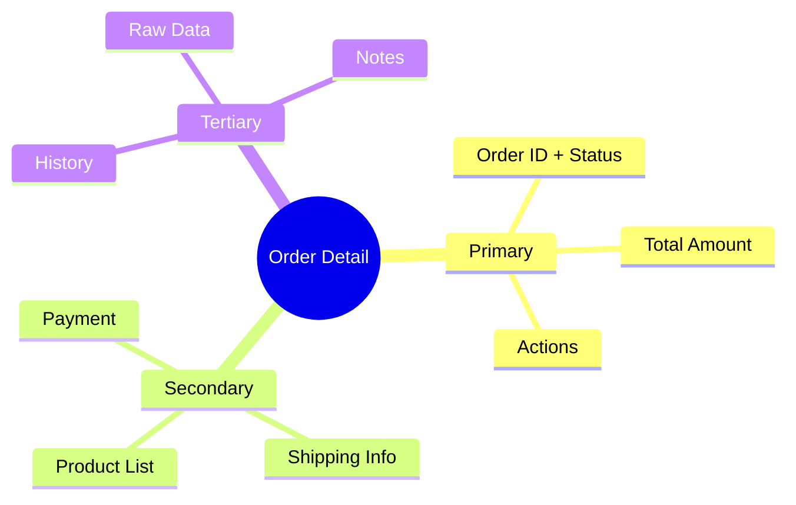

# Brainstorming Techniques Reference

Detailed instructions for each technique. Load on demand — not all techniques used in every session.

---

## 1. Define the Goal (Jobs-to-be-Done)

**Purpose:** Clarify what the page/feature must accomplish before designing anything.

**Steps:**
1. Ask: "Who will use this page?"
2. Ask: "What are they trying to accomplish?"
3. Ask: "What happens after they succeed?"
4. Combine into statement: "When [situation], [user] wants to [action] so they can [outcome]."
5. Validate: "Does this capture what you're building? Anything missing?"

**Example:**
- Designer says: "I need an order tracking page"
- Goal: "When a seller has pending orders, they want to see order status at a glance so they can prioritize which orders to process first."

**Tips:**
- If designer gives vague answer ("everyone uses it"), push for specificity
- One JTBD per page. If multiple jobs → consider splitting into multiple pages
- The goal guides all subsequent decisions — refer back to it when evaluating options

---

## 2. Dig Deeper (5 Whys + First Principles)

**Purpose:** Challenge assumptions and find root causes when stuck.

**Steps:**
1. State the problem or assumption
2. Ask "Why is that needed?" — record answer
3. Ask "Why?" about the answer — record
4. Repeat 3-5 times until you reach a fundamental truth
5. Reframe the problem based on root cause

**Example:**
- "We need a table here." → Why? → "Users need to compare data." → Why compare? → "To find outliers." → Why find outliers? → "To take action on exceptions."
- Reframe: "This isn't a comparison page — it's an exception handler. Maybe a filtered alert view works better than a full table."

**Tips:**
- Works best when a design feels "off" but designer can't explain why
- Stop when answers become circular or reach business/user fundamentals
- The reframe often suggests a completely different component choice

---

## 3. Explore Options (Constraint-Based Ideation)

**Purpose:** Generate concrete layout alternatives within real boundaries.

**Steps:**
1. Define constraints together:
   - Available DS components (from catalog)
   - Data shape (how many items? what fields?)
   - Screen context (sidebar visible? mobile needed?)
   - User priority (what's most important to see first?)
2. Generate 3-4 layout options, each with:
   - Which Ak* components used
   - Rough arrangement description
   - Mermaid diagram if helpful
   - Pros and cons
3. Ask designer to pick one or combine elements

**Constraint Template:**
```
Components available: [list from catalog]
Data: [X items with fields A, B, C]
Priority info: [what user needs first]
Screen: [full width / sidebar visible / mobile]
Interactions: [filter / sort / click-through / edit]
```

**Example Options Format:**
| Option | Layout | Components | Pros | Cons |
|--------|--------|------------|------|------|
| A | Table with filters | AkTable + AkInput + AkSelect | Familiar, scannable | Dense for few items |
| B | Card grid | AkCard + AkBadge | Visual, spacious | Hard to compare |
| C | Split view | AkTable left + detail right | Efficient | Complex on mobile |

---

## 4. Map the Content (Mind Mapping)

**Purpose:** Organize all information before deciding on layout.

**Steps:**
1. Ask: "List everything that needs to appear on this page."
2. Group related items (by user task, not data type)
3. Rank groups by importance (primary / secondary / tertiary)
4. Generate text tree + Mermaid mindmap

**Text Tree Format:**
```
Order Detail Page
  Primary (always visible)
    Order ID + status badge
    Total amount
    Action buttons (confirm, cancel)
  Secondary (prominent but below fold)
    Product list (table)
    Shipping info
    Payment summary
  Tertiary (available but tucked away)
    Order history / timeline
    Internal notes
    Raw data / IDs
```

**Mermaid Mindmap:**


**Tips:**
- Designers often forget edge cases — prompt: "What about empty states? Error states? Loading?"
- Group by what users DO, not by database tables
- Primary content determines which DS component is the page's "hero"

---

## 5. Test the Flow (Cognitive Walkthrough)

**Purpose:** Simulate a user completing the main task to catch gaps.

Load `references/cognitive-walkthrough-template.md` for the full template.

**Quick version:**
1. Define the task: "[User] wants to [complete action]"
2. Walk through step by step:
   - What does the user see first?
   - What do they click/tap?
   - What feedback do they get?
   - What's the next step?
   - How do they know they're done?
3. At each step, ask:
   - Is it obvious what to do?
   - Is the right component visible?
   - Does the feedback match expectations?
4. Flag gaps: missing states, unclear labels, dead ends

---

## 6. Check the Layout (Gestalt Principles)

**Purpose:** Evaluate visual organization using perception rules.

**Principles to check:**

| Principle | Question | DS Fix |
|-----------|----------|--------|
| **Proximity** | Are related items close together? | Use `var(--space-2)` within groups, `var(--space-5)` between groups |
| **Similarity** | Do similar items look alike? | Consistent AkBadge colors for same status type |
| **Contrast** | Does important info stand out? | `font-weight: 700` for headings, AkButton `color="primary"` for main action |
| **Enclosure** | Are groups visually contained? | Wrap in card divs with `var(--shadow-sm)` and `var(--radius-md)` |
| **Hierarchy** | Can you scan top-to-bottom and get the gist? | Primary info at top, progressive disclosure for detail |

**Tips:**
- Most layout issues are proximity problems — things that belong together are visually separated
- If everything looks the same importance → missing contrast/hierarchy
- Suggest specific tokens: "Add `var(--space-6)` gap between these sections"

---

## 7. Audit Usability (Nielsen Heuristics)

**Purpose:** Systematic usability check before implementation.

Load `references/nielsen-heuristics.md` for the full adapted checklist.

**Quick scorecard:**

| # | Heuristic | Check |
|---|-----------|-------|
| 1 | Status visibility | Can user see current state? (AkBadge, AkAlert) |
| 2 | Match real world | Do labels match user language? |
| 3 | User control | Can they undo/go back? (AkButton, AkModal cancel) |
| 4 | Consistency | Same patterns as other pages in prototype? |
| 5 | Error prevention | Required fields marked? Confirmations for destructive actions? |
| 6 | Recognition > recall | Options visible vs. hidden in menus? |
| 7 | Flexibility | Power users have shortcuts? |
| 8 | Minimal design | Every element earns its space? |
| 9 | Error recovery | Clear error messages? (AkAlert type="error") |
| 10 | Help | Complex features have tooltips or guidance? |

Score each: Pass / Minor issue / Major issue. Focus on Major issues first.
